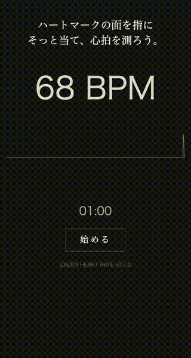
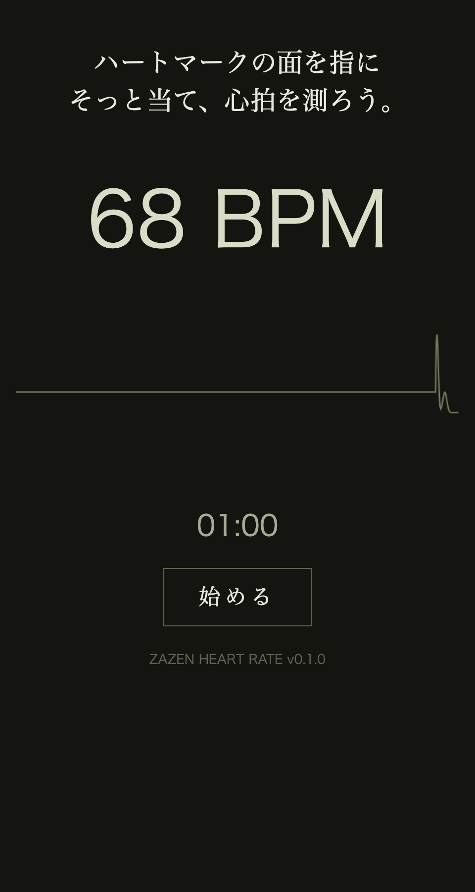
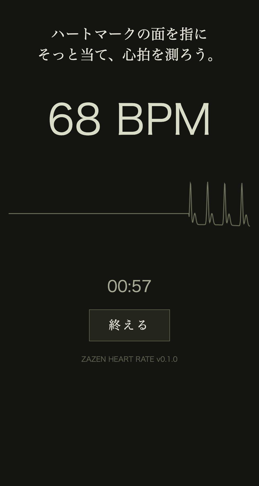
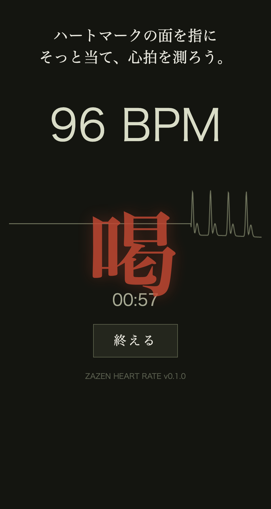
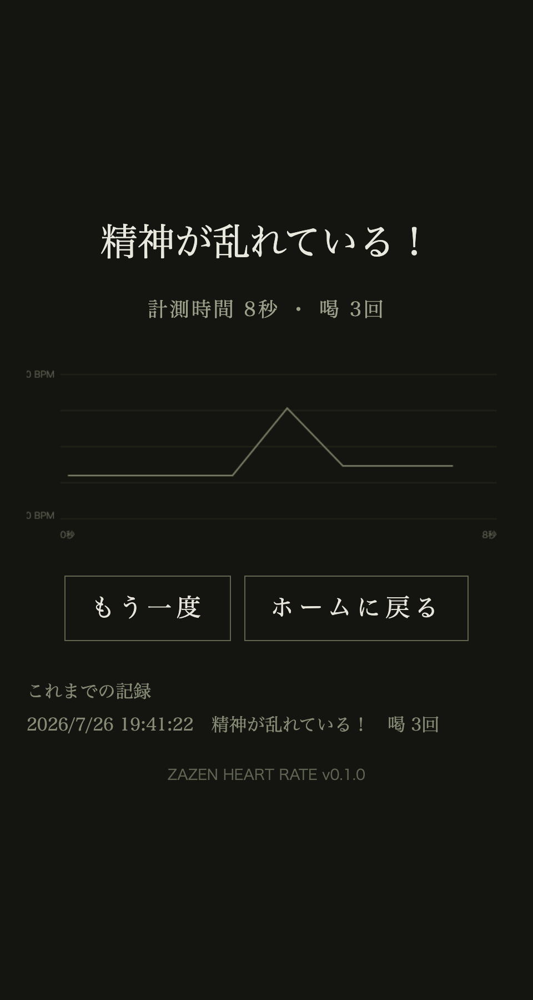

# 坐禅 心拍 — ZAZEN HEART RATE

ESP32 + 脈波センサで心拍を測り、ブラウザに波形と BPM を表示する「坐禅アプリ」です。
1 分間の計測中に心拍が乱れると **「喝」** が表示され（音付き）、終了後に統一/乱れの判定と心拍グラフ・履歴が出ます。



> 上の GIF が表示されない場合は [`docs/demo.mp4`](docs/demo.mp4) を参照してください。

## 画面

| ホーム | 計測中 | 喝 | 結果 |
|:---:|:---:|:---:|:---:|
|  |  |  |  |

## 仕組み

```
[脈波センサ] --アナログ--> [ESP32] --Wi-Fi/HTTP--> [スマホ/PC のブラウザ]
   GPIO34                  Web サーバ (LittleFS)         波形・BPM 表示
```

- ESP32 が Wi-Fi に接続し、Web サーバ（ポート 80）として動作
- `/` … `data/index.html`（LittleFS に書き込んだUI）を配信
- `/data` … `{"signal": <生波形>, "bpm": <心拍数>}` を JSON で返す
- ブラウザ側の JavaScript が `/data` を約 20ms 間隔でポーリングして描画・判定

主要ロジックは [`src/main.cpp`](src/main.cpp)、UI は [`data/index.html`](data/index.html) にあります。

## 必要なもの

- ESP32 開発ボード（`board = esp32dev`）
- 脈波（パルス）センサ — アナログ出力を **GPIO34** に接続
- [PlatformIO](https://platformio.org/)（VS Code 拡張 or CLI）

## セットアップ

### 1. Wi-Fi 認証情報を設定

認証情報はソースに直書きせず `.env` から読み込みます（`.env` は `.gitignore` 済み）。

```bash
cp .env.example .env
```

`.env` を編集：

```
WIFI_SSID=接続先SSID
WIFI_PASSWORD=接続先パスワード
```

ビルド時に [`load_env.py`](load_env.py) が `.env` を読み、`-D WIFI_SSID=...` としてコンパイル時マクロに注入します（`platformio.ini` の `extra_scripts` 参照）。

> **固定 IP について**: `src/main.cpp` の `localIP` / `gateway` / `subnet` は接続先ネットワークに合わせて書き換えてください（既定は `192.168.128.250`）。

### 2. 書き込み

```bash
# 初回のみ（必要なら）フラッシュ消去
platformio run --target erase

# ファームウェア書き込み
platformio run --target upload

# UI（LittleFS の中身 = data/）を書き込み
platformio run --target uploadfs
```

> **注意**: `uploadfs` を忘れると `index.html not found` になります。
> シリアルモニタは書き込みの **後** に開いてください。

### 3. アクセス

シリアルモニタ（115200 baud）に表示される IP をブラウザで開きます：

```
接続完了! このアドレスをブラウザで開いてください → http://192.168.128.250
```

## ローカル共有・オフライン運用について

**結論：インターネットは不要です。** このアプリは ESP32 とブラウザ端末が
**同じローカルネットワークにいれば動作**し、外部通信は一切しません。
用途に応じて 3 通りの構成が可能です。

### A. 既存の Wi-Fi ルータを使う（現状の構成）

家庭/オフィスのルータに ESP32 とスマホをつなぐだけ。ルータがインターネットに
つながっていなくても、LAN 内で完結するので問題なく動きます。

### B. ESP32 単体で Wi-Fi を出す（SoftAP・最も手軽なオフライン）

ルータも Raspberry Pi も不要。ESP32 自身をアクセスポイントにして、スマホから
直接その Wi-Fi に接続します。完全オフライン・機材ゼロで持ち運べます。
`WiFi.begin(...)` の代わりに SoftAP を使うよう `src/main.cpp` を変更します：

```cpp
// STA モード（既存）の代わりに:
WiFi.softAP("ZAZEN-HR", "zazen1234");        // SSID / パスワード（8文字以上）
Serial.println(WiFi.softAPIP());              // 既定 192.168.4.1
```

以降はスマホで `ZAZEN-HR` に接続し `http://192.168.4.1` を開くだけ。

### C. Raspberry Pi 1 を private なアクセスポイントにする

「みんなで同じ private ネットワークに集まりたい」「複数端末で共有したい」
場合は、Raspberry Pi をインターネット非接続のローカル AP にできます。

- `hostapd`（AP 化）+ `dnsmasq`（DHCP）で自前の Wi-Fi を構成
- ESP32 とスマホをその Wi-Fi に接続 → LAN 内で完結（インターネット不要）
- 処理は軽いので **Raspberry Pi 1 でも十分**動きます

ただし Raspberry Pi 1 には注意点があります：

- **内蔵 Wi-Fi が無い** → AP 対応の **USB Wi-Fi ドングル**が必要（`nl80211`/AP モード対応のチップを選ぶ）
- 1 コア・低メモリなので、AP + DHCP 程度の用途に留めるのが無難

> どの構成でも「ESP32 が Web サーバ、ブラウザが表示」という基本は同じで、
> **B が最も手軽**、**C は複数人・据え置き運用向け**です。Raspberry Pi に
> UI をホストさせる必要はありません（ESP32 が配信するため）。

## ディレクトリ構成

```
.
├─ src/main.cpp        ファームウェア本体（Wi-Fi 接続・Web サーバ・心拍検出）
├─ data/index.html     ブラウザ UI（LittleFS へ uploadfs で書き込む）
├─ load_env.py         .env を読んで build_flags に注入する PlatformIO スクリプト
├─ platformio.ini      ビルド設定
├─ .env.example        Wi-Fi 認証情報のテンプレート
├─ docs/               README 用スクリーンショット・デモ動画
└─ .env                実際の認証情報（Git 管理外）
```

## 調整ポイント

`src/main.cpp` / `data/index.html` の主な定数：

| 項目 | 場所 | 既定 | 説明 |
|---|---|---|---|
| `THRESHOLD` | main.cpp | 2200 | 心拍検出のしきい値。波形を見て調整 |
| `PULSE_PIN` | main.cpp | 34 | 脈波センサの入力ピン |
| `MAX_BPM` | index.html | 100 | これ以上で「喝」 |
| `SUDDEN_CHANGE_BPM` | index.html | 20 | この幅の急変で「喝」 |
| `SESSION_LENGTH_MS` | index.html | 60000 | 1 セッションの長さ（ms） |
